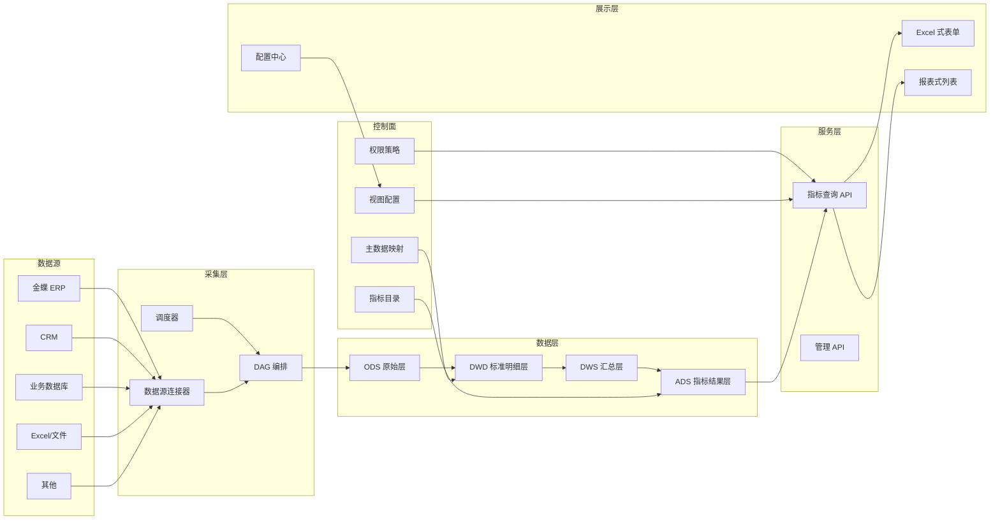

# 财务核算指标系统设计方案

> 版本：v0.1（设计草案）
> 日期：2026-09-24
> 适用范围：基于现有 FastapiAdmin 二次开发，面向 ERP/CRM/Excel/其他来源的财务核算指标中台。

## 1. 项目目标

建设一个财务核算指标系统，解决以下问题：

1. 从 ERP、CRM、Excel 及其他系统统一采集数据。
2. 统一不同来源的部门、人员编码与名称。
3. 对功能、字段、指标、数据行进行严格权限管控。
4. 支持可配置的 Excel 式表单和报表式展示。
5. 支持日、周、月等不同期间的指标计算与调度。
6. 数据源可扩展：API、数据库、文件等。

系统定位为“核算指标中台”，不是替代 ERP，而是把多个业务系统的数据汇聚、标准化、计算、展示。

## 2. 现状与边界

### 2.1 现有框架可复用能力

| 能力 | 现状 | 复用方式 |
|------|------|----------|
| 后端框架 | FastAPI + SQLAlchemy Async + Pydantic | 继续作为业务底座 |
| 权限 | 菜单/按钮 RBAC + 基础 data_scope | 扩展为字段/指标/行级权限 |
| 调度 | APScheduler + Redis 分布式锁 | 扩展为 DAG 依赖编排 |
| 文件存储 | SFTP/S3/OSS/COS/OBS | 复用为文件类数据源 |
| Excel | openpyxl 导入导出 | 复用为 Excel 数据源 |
| 前端 | Vue3 + Element Plus + ECharts | 扩展可配置表格/报表 |
| 模块规范 | controller/service/crud/model/schema | 新业务继续沿用 |

### 2.2 当前已落地内容

- 金蝶云星空 SDK 已接入 `backend/vendor`，并已加入 `pyproject.toml`、`requirements.txt`、`uv.lock`。
- 已新增 `backend/app/modules/erp/kingdee` 模块：
  - 连接配置 CRUD
  - 连接测试
  - 单据查询 `POST /erp/kingdee/query`
  - 业务对象查看 `POST /erp/kingdee/view`
  - 支持从 `backend/env/kindee_conf.ini` 直接构造本地测试客户端
  - 提供 `scripts/kingdee_org_view.py`、`scripts/sync_kingdee_org.py`、`scripts/kingdee_dept_view.py`、`scripts/sync_kingdee_dept.py`
- 金蝶连接密码使用现有 Fernet 加密，查询接口兼容官方 SDK 返回格式。
- 已新增 `backend/app/modules/masterdata` 主数据模块：
  - 标准组织树 CRUD 与树查询
  - 标准人员 CRUD
  - 来源组织/人员分页查询
  - 组织/人员映射 CRUD
  - 按编码自动匹配组织/人员
  - 已新增 `master_dept`、`master_person_org`、`source_dept`、`master_dept_mapping` 模型
  - 提供 `scripts/bootstrap_master_dept.py` 从来源部门初始化标准部门与映射
  - 提供 `scripts/sync_kingdee_person.py` 同步金蝶员工并初始化标准人员/映射
  - 提供 `scripts/sync_kingdee_person_org.py` 从员工 View 接口同步人员-组织-部门关系
  - 已新增 `metadata` 模块：来源系统/对象/字段、标准实体/字段、字段映射配置
  - 已新增 `metric` 模块：指标定义、计算批次、指标结果、穿透追溯
  - 已新增前端 `module_metadata/index` 配置页与 `api/module_metadata`
  - 提供 `scripts/seed_metadata_menu.py` 初始化元数据菜单
  - 已新增 `system-mapping` 模块与前端 `module_system_mapping/index` 页面
  - 已新增 `meta_sync_job` / `meta_sync_run`，支持 Cron 表达式管理元数据同步
  - 已提供 `scripts/seed_account_balance_metadata.py` 初始化科目余额表元数据
  - 已新增前端 `module_metadata_view/index` 元数据查看页
  - 已新增前端 `module_manual_binding/index` 人工绑定页与 `/system-mapping/bind/*`、`/unmapped/*`、`/options/*`
  - 已修复元数据同步分页缺陷：金蝶报表单次只返回 `Limit` 行，原实现只取第一页（2000 行），
    导致科目余额表 5xxx/6xxx 科目整段丢失；现按 `StartRow` 翻页取全量
  - 已新增指标计算引擎 `backend/app/modules/metric/engine.py`（配置化取数，v1 支持科目余额表过滤聚合）
    与日调度 `backend/app/modules/metric/schedule.py`（每天 02:30 重算）
  - 已落地营销中心系列 20 个月指标（口径在 `backend/scripts/seed_marketing_metrics.py` 声明式维护，
    加指标只需在列表里加一条）：办公费用（含办公费）、差旅费用（含差旅费 / 交通费 / 交通差旅）、
    车辆费用（含车辆维修费 / 车辆年审保养保险 / 车油卡充值 / 停车费）、低值耗材（含低值耗材）、
    电话费（含电话费）、国际快递费（含外贸快递）、国内快递费（含内贸快递 / 快递费）、
    福利费（含其他福利）、水电费（含水费 / 电费）、平台费（含专用平台费用 / 平台交易服务费 /
    平台费（非运营平台-公众号）/ 平台固定费（年费/月租）/ 平台延迟发货赔付费）、
    售后费用（含售后其它费用 / 售后运输费 / 售后赔偿费 / 售后返工费）、
    业务招待费（含业务招待费）、运输费（含运输费用）、招聘服务费（含招聘费）、
    咨询服务费（含咨询服务费）、维修费（含维修费 / FWX辅/维修，排除车辆维修费）、
    折旧费用（含折旧费用）、推广费（含推广补单服务费 / 推广外链充值 / 推广展会费用 /
    推广运营费 / 推广店铺直通车 / 推广SEO工具费用 / 推广物流单号费）、
    租金及物业管理费（含场地租金 / 物业管理费）——所有组织、科目 `6601` 销售费用、
    当期借方发生额（`FDEBIT`）汇总；另有余额类指标「营销中心应收余额」：
    科目 `1122` 应收账款、剔除编码 100-113 的内部客户，取期末余额（`FENDDEBIT` - `FENDCREDIT`），
    明细维度为客户；月指标每日重算当月数值，每次计算保留一个 `calc_version`
  - 已落地月指标「营销中心坏账计提」（口径在 `backend/scripts/seed_ar_aging_metric.py`
    声明式维护）：来源是金蝶《应收款账龄分析表》（`AR_AgingAnalysis`，`FByBill=true` 按单据显示），
    取「尚未收款金额（本位币）`FBalanceAmt`」**按往来单位取净值，客户净额 ≤ 0 的不纳入计提**
    （`measures.netting = "customer"`；改成 `"bill"` 即逐单计提），净额为正的客户按账龄区间计提——
    0-30 天 0%、31-60 天 5%、61-90 天 10%、91-180 天 20%、181-365 天 50%、1 年以上 100%；
    账龄基准默认到期日 `FEndDate`（缺失退化为业务日期 `FDate`），剔除编码 100-113 的内部客户，
    明细维度为往来单位（客户）；账龄截止日 = 期末日（当期取今天）
    （2026-09 实测：14 个组织计提 3,144.41 万，计提基数 5,230.28 万 = 净额为正客户的净额合计，
    纳入计提客户 18,969 家、净额非正被排除客户 7,765 家）
  - 《应收款账龄分析表》WebAPI 要点（踩坑记录）：`FSettleOrgLst` 传的是**结算组织内码**
    （如 `167900` 对应组织 `101`，可从 `ORG_Organizations` 的 `FNumber/FOrgID` 取），
    不是组织编码；`FAgingCalStd` 不能为空串（传 `"0"`）；`FExChangeRateType.FNUMBER`
    建议填 `HLTX01_SYS`；**只有带 `FEntAgingGrpSetting`（账龄分组设置）时报表才返回
    「尚未收款金额（本位币）`FBalanceAmt`」，且会多出 `xxx(小计)` 行（无单据编号，必须跳过）**；
    账龄区间的列是动态字段，FieldKeys 取不到，所以按区间计提由引擎按单据日期现算
  - 账龄计提的取数方式：一次全量约 7MB/组织（组织 101 约 4.6 万行），按天落
    `meta_sync_run.rows_json` 会迅速撑大库，因此该指标**不落同步批次**：来源对象下按组织
    登记 14 个同步任务（只登记组织与结算组织内码、不配 Cron），计算时由引擎并发实时取数
    （`engine._fetch_live_aging_payloads`，`kind = ar_aging_provision`）
  - 指标取数引擎支持的配置项（`measures`）：`account_prefix` 科目前缀、`amount_field` 单字段金额、
    `amount_terms` 多字段借贷相减（如期末余额）、`detail_name_contains` / `detail_name_exclude` 维度名称包含与排除、
    `detail_code_exclude_in` 维度编码排除（如剔除内部客户）、`require_detail` 跳过科目汇总行、
    `detail_is_department` 维度是否按部门拆分、`org_codes` 限定只取某几个组织的同步任务
    （与 `account_balance_filter` 这类「来源对象下多组织同步任务」搭配使用，缺省取全部启用组织）
  - 汇总指标 `kind = metric_sum`：值 = 若干组成指标当期值之和（`component_metric_codes` 声明组成指标；
    `group_by_org = true` 时按组织分别汇总）。已落地「营销中心费用合计」，
    由办公费 / 差旅费 / 车辆费用 / 低值耗材 / 电话费 / 福利费 / 国际快递费 / 国内快递费 / 平台费 /
    咨询服务费 / 售后费用 / 水电费 / 推广费 / 维修费 / 业务招待费 / 运输费 / 招聘服务费 共 17 个费用指标，
    再加网商协会费 / 信息技术服务费 / 库存资金占用费（公司级，单列为组织为空的一行），合计 20 个组成指标
    ；另有固定费用口径的**营销中心营销固定费用小计** = 营销中心折旧费用 + 营销中心租金及物业管理费
    （同样按组织分别合计）
  - 比率指标 `kind = metric_ratio`：值 = 分子指标当期值之和 ÷ 分母指标当期值之和 × `ratio_scale`
    （`numerator_metric_codes` / `denominator_metric_codes` 各声明一组指标，默认 `ratio_scale = 1`，
    另可用 `numerator_subtrahend_metric_codes` / `denominator_subtrahend_metric_codes` 给分子/分母各挂一组减项
    （净额 = 加项之和 − 减项之和，如安全边际率的分子是「总收益 − 盈亏平衡点销售额」），
    分母为 0 时取 0 避免除零；与 `metric_sum` / `metric_scale` 一样**自身不取数**，
    计算前先补齐缺结果的组成指标）。首个使用该类型的是「营销中心下推率」
    （= 下推金额（未税）÷ 接单金额（未税）× 100%，`ratio_scale = 100` 输出百分数）
  - 差额指标 `kind = metric_diff`：值 = 加项指标当期值之和 − 减项指标当期值之和
    （`addend_metric_codes` / `subtrahend_metric_codes` 各声明一组指标，缺项按 0 计入；
    与 `metric_sum` / `metric_scale` / `metric_ratio` 一样**自身不取数**，计算前先补齐缺结果的组成指标）。
    首个使用该类型的是「营销中心边际贡献」（= 总收益（营销结算收入）− 变动费用合计）
  - 期初期末平均指标 `kind = metric_balance_avg`：值 = 上一期组成指标合计 × `begin_weight`
    + 当期组成指标合计 × `end_weight`（默认各 0.5，即「（期初 + 期末）÷ 2」）。
    `component_metric_codes` 声明组成指标，期初取**上一期**该指标结果（月指标即上月末；
    引擎会先把上一期的组成指标结果也补齐，上一期仍无结果则按 0 计入并告警）；
    与 `metric_sum` / `metric_scale` / `metric_ratio` 一样自身不取数。首个使用该类型的是
    「营销中心平均库存（未税）」（=（期初 + 期末）÷ 2 的「营销中心库存合计（未税）」）
  - 已新增前端「指标结果」页 `frontend/web/src/views/module_metric/value/index.vue`
    与 `backend/scripts/seed_metric_menu.py` 菜单种子：按指标 / 期间 / 组织查询，
    支持组织合计与数据明细（核算维度：部门 / 客户）切换、手动重算，接口 `GET /metric/value/page`、
    `POST /metric/def/run/{id}`
  - 指标支持按期间重算（历史期间回补）：`meta_sync_run.period_value` 记录批次取数期间，
    同步任务可传期间渲染 `{{year}}`/`{{month}}`；计算引擎按期间匹配批次，
    缺批次时自动按该期间回补取数，不再复用当月数据
  - 指标结果保留核算维度原始信息：`metric_value.dept_code` / `dept_name` 记录 ERP 的部门编码与名称
    （未映射到 `master_dept` 也保留），层级判定按原始编码而非映射结果，
    避免「未映射部门行被当成组织合计」造成重复计入；维度无部门前缀时部门显示为「未指定部门」
  - 指标口径支持排除关键字 `detail_name_exclude`：关键字互为子串时用它去重
    （如「维修费」会命中「车辆维修费」，维修费指标排除后者，车辆维修费只计入车辆费用指标）
  - 已新增指标开放接口模块 `backend/app/modules/openapi`，对外提供 `/open/v1` 只读接口：
    应用凭证换令牌（`POST /open/v1/auth/token`）、指标目录（`GET /open/v1/metrics`）、
    批量取数（`POST /open/v1/metrics/query`，支持长表/宽表、期间区间、组织范围）、
    组织字典（`GET /open/v1/orgs`）、触发重算（`POST /open/v1/metrics/{code}/run`，默认不开放）；
    默认全部启用指标可读、默认只返回组织合计，部门/客户明细需按应用开启，
    并按应用做 IP 白名单、每分钟限流与调用日志（`open_client`、`open_api_log` 两张表）
  - 已新增前端「开放接口」菜单：接入应用管理页 `frontend/web/src/views/module_openapi/client/index.vue`
    （新增/编辑/停用/重置密钥/组织范围/明细开关/限流）与调用日志页
    `frontend/web/src/views/module_openapi/log/index.vue`，菜单种子
    `backend/scripts/seed_openapi_menu.py`，首应用创建脚本 `backend/scripts/seed_openapi_client.py`
  - 对外对接说明见 `docs/指标开放接口对接说明.md`，接口设计见 `docs/指标开放接口设计.md`
  - 已接入 CRM 数据源（`backend/app/modules/crm`，`connector_type = "crm"`）：GET、无需鉴权，
    公共参数 `dateRange` 按整月闭区间渲染，其余参数（如报价统计的 `transformation`）原样透传；
    取数执行器 `kind = api_scalar_amount` 支持「取单个字段」与「两字段比率」（`numerator_field` /
    `denominator_field` / `ratio_scale`），单值分支支持 `value_scale` 取值倍数（接口返回正数、
    本系统要按负数入账时传 `-1`）；表 `crm_connection` 保存连接配置
  - 营销中心 CRM 系列 11 个月指标（口径在 `backend/scripts/seed_crm_marketing_metrics.py` 声明式维护，
    `SOURCE_OBJECTS` 一接口一条、`METRICS` 一指标一条，多个指标可共用同一接口的取数批次）：
    内贸/外贸/零售/批量/打样/备货订单（未税）、设计费收入（未税）取自 CRM《订单未税金额接口文档》；
    报价次数、报价成功率、报价毛利率取自 CRM《报价单统计接口文档》；另有汇总指标
    「接单金额（未税）」（取数类型 `kind = metric_sum`，合计零售/批量/打样/备货订单（未税）与
    设计费收入（未税）5 项的当期结果——**内贸/外贸订单是全部订单的总计，与按 order_type 拆分的
    零售/批量/打样重复，不计入**；计算顺序由 `backend/app/modules/metric/batch.py`
    按 `measures` 声明的依赖**拓扑分层**（组成指标所在层先执行、同层并发），
    运行期再由 `engine.py` 的 `_ensure_component_values` 校验组成指标「当天已算过」
    并补算——单指标重算与开放接口触发也走这条兜底逻辑）；
    直连自检脚本 `backend/scripts/crm_check.py`（覆盖全部 13 个接口）
  - 营销中心 CRM「出货 / 设计服务 / 退款」11 个月指标（口径在
    `backend/scripts/seed_crm_shipment_metrics.py` 声明式维护，数据源 CRM《HASH 接口文档》，
    与订单未税系列共用同一个 CRM 连接与来源系统）：**批量出货（未税）**
    （`/hs/getpiliangchuhuo`）、**打样出货（未税）**（`/hs/getdayangchuhuo`）、
    **设计服务收入（未税）**（`/hs/getShejifei`）、**退货/退款（负数）**（`/hs/getReturnOrder`，
    接口返回正数，用 `value_scale = -1` 取负入账）；
    出货两类按 `chuhuo_date`（出货日期）统计、要求 `status=384` + `has_finish=1` + `chuhuo=1` +
    `qty>0`，金额 = 未税单价 × 累计出货数量；设计服务与退款按 `createtime`（订单创建时间）统计，
    退款口径为 `status=522`；接口字段名有两处坑照实际行为取数（打样出货返回键仍是 `piliangchuhuo`、
    退款返回值嵌一层同名键 `data.data`）；另有 2 个汇总指标（`kind = metric_sum`）与 1 个折算指标
    （`kind = metric_scale`，值为「组成指标当期值之和 × `scale` 系数」），三者自身都不取数：
    **营销中心货物出货（未税）** = 批量出货（未税）+ 打样出货（未税）+ 零售出货（未税）——
    CRM 侧无零售出货接口（16 个候选路径实测均 404），零售出货取本系统已有的聚水潭指标
    「零售出库未税总金额」`retail_outbound_untaxed_amount`，CRM 开放该接口后换编码即可；
    **营销中心对外出货未税销售额（净额）** = 货物出货（未税）+ 设计服务收入（未税）+
    退货/退款（负数）（汇总指标可嵌套汇总指标，负值直接相加）；
    **营销中心总收益（营销结算收入）** = 对外出货未税销售额（净额）× 10%
    （`kind = metric_scale` + `scale = 0.1`，引擎新增该取数类型）；
    另有 3 个**报表列示**指标（同为 `metric_scale`，**仅列示、不是实际成本核算**）：
    材料成本（列示）= REV-01 × 20%、制造费用-变动（列示）= REV-01 × 8%、
    制造费用-固定（列示）= REV-01 × 6%（REV-01 即对外出货未税销售额（净额）），
    以及其汇总指标**营销中心产品成本小计（列示）** = 上述三项列示成本之和（REV-01 × 34%）
    ；以及**营销中心制造成本率（材料及能源）** = 产品成本小计（列示）÷ 对外出货未税销售额（净额）× 100%
    （比率指标 `kind = metric_ratio`；分子是列示口径 REV-01 × 34%，故该比率恒为 34%，
    只有列示比例调整时才变；仅列示、不是实际制造成本率）
  - 营销中心「总部分摊（PER-02）」11 个月指标（口径在 `backend/scripts/seed_marketing_allocation_metrics.py`
    声明式维护，**全部为派生指标：不建来源对象、不建同步任务、不调外部接口**）：
    PER-02 总部分摊合计 = PER-02-a + PER-02-b + PER-02-c；HR 分摊（PER-02-a）= a-1 + a-2、
    财经分摊（PER-02-b）= b-1 + b-2、AI 数智化分摊（PER-02-c）= c-1 + c-2；
    6 个明细项均为「REV-01（对外出货未税销售额（净额））× 固定比例」的 `metric_scale`：
    HR 变动/固定各 0.40%、财经变动/固定各 0.32%、AI 数智化变动/固定各 0.28%（变动 + 固定各占一半，
    分组合计即 HR 0.80% / 财经 0.64% / AI 数智化 0.56%，总计 2.00%）；父级用 `metric_sum` 合计子项，
    与规则表「= 子项相加」一致，避免同口径出现两份数；仅分摊列示，**不是实际发生额**。
    该脚本另含十三个**跨系列**汇总指标（公司整体口径，PER-02 三项无组织维度，故不按组织拆分）：
    **营销中心固定费用合计**（`marketing_fixed_expense_total`）= 营销固定费用小计
    （`marketing_fixed_expense_subtotal`，科目余额表口径，定义在 `seed_marketing_metrics.py`）
    + HR 固定 + 财经固定 + AI 数智化固定；**营销中心变动费用合计**
    （`marketing_variable_expense_total`）= 营销中心费用合计（`marketing_total_expense`）
    + HR 变动 + 财经变动 + AI 数智化变动；**营销中心边际贡献**（`marketing_contribution_margin`，
    `kind = metric_diff`）= 总收益（营销结算收入）（`marketing_total_income_settlement`）
    − 变动费用合计；**营销中心边际贡献率**（`marketing_contribution_margin_rate`，
    `kind = metric_ratio`、`ratio_scale = 100`）= 边际贡献 ÷ 总收益（营销结算收入）× 100%；
    **营销中心结算收益**（`marketing_settlement_income`，`kind = metric_diff`）
    = 边际贡献 − 固定费用合计；**营销中心结算收益率**（`marketing_settlement_income_rate`，
    `kind = metric_ratio`、`ratio_scale = 100`）= 结算收益 ÷ 对外出货未税销售额（净额）REV-01 × 100%；
    **营销中心盈亏平衡点销售额**（`marketing_break_even_sales`，`kind = metric_ratio`、
    `ratio_scale = 100`，分母是百分数口径的边际贡献率）= 固定费用合计 ÷ 边际贡献率；
    **营销中心安全边际率**（`marketing_margin_of_safety_rate`，`kind = metric_ratio`、
    `ratio_scale = 100`）=（总收益（营销结算收入）− 盈亏平衡点销售额）÷ 总收益（营销结算收入）× 100%；
    **营销中心单位时间附加值**（`marketing_value_added_per_hour`，`kind = metric_ratio`、
    `ratio_scale = 1`、单位显式声明为「元/小时」）= 结算收益 ÷ 总劳动时间
    （总劳动时间取自 CRM 企微打卡，2026-01 ~ 2026-03 接口无数据、工时为 0，该指标同月亦为 0）
    ；**营销中心变动费用率（不含人工）**（`marketing_variable_expense_rate`，
    `kind = metric_ratio`、`ratio_scale = 100`）= 变动费用合计 ÷ 对外出货未税销售额（净额）REV-01 × 100%
    （「不含人工」指分子取自科目 6601 费用项目口径——该口径没有工资/社保类费用项目，
    仅含福利费、招聘服务费；若要额外扣掉 PER-02 的 HR 变动分摊，比率会再低 0.40 个百分点）
    ；**营销中心固定费用率（不含人工）**（`marketing_fixed_expense_rate`，
    `kind = metric_ratio`、`ratio_scale = 100`）= 固定费用合计 ÷ 对外出货未税销售额（净额）REV-01 × 100%
    ；**营销中心成本费用率（不含人工）**（`marketing_cost_expense_rate`，`kind = metric_ratio`、
    `ratio_scale = 100`）=（营销中心费用合计 + 营销固定费用小计 + 总部分摊合计）
    ÷ 对外出货未税销售额（净额）REV-01 × 100%（与「固定费用率 + 变动费用率」恒等，可交叉校验）
    ；**营销中心库存资金占用率**（`marketing_inventory_capital_cost_rate`，`kind = metric_ratio`、
    `ratio_scale = 100`）= 库存资金占用费 ÷ 对外出货未税销售额（净额）REV-01 × 100%
  - 营销中心 CRM「订单下推周期」13 个月指标（口径在 `backend/scripts/seed_crm_push_metrics.py`
    声明式维护，数据源 CRM《订单下推周期接口文档》，与订单/出货系列共用同一个 CRM 连接与来源系统）：
    **本月接单本月下推（未税）**（`/hs/push/getPush`）、**前期接单本月下推（未税）**（同接口）、
    **下推金额（未税）合计**（汇总指标 `kind = metric_sum` = 前两条相加，自身不取数）、
    **下推率**（比率指标 `kind = metric_ratio` = 下推金额（未税）÷ 接单金额（未税）× 100%，自身不取数；
    分母「接单金额（未税）」属订单系列，比率可 >100%——某月下推的是更早期接单的订单时会这样）、
    **下推周期（天）**（`/hs/push/getPushPeriod`）、**批量 / 打样 / 内贸 / 外贸下推周期**
    （`getBatchPushPeriod` / `getSamplePushPeriod` / `getDtPushPeriod` / `getFtPushPeriod`）、
    **批量内贸 / 批量外贸 / 打样内贸 / 打样外贸下推周期**（`getBatchDtPushPeriod` /
    `getBatchFtPushPeriod` / `getSampleDtPushPeriod` / `getSampleFtPushPeriod`）；
    过滤口径统一为仅统计 `erp_push_status=1` + `status=384` 的订单，但**取值为两套口径**：
    ① `getPush` 两条是**下推未税金额（元）**（上游 2026-09-28 二次改造后口径：不再接收 `type`，
    改为两个范围参数——下推时间 `pushDateRange` + 接单时间 `createDateRange`，金额 =
    内贸 `SUM(receivable - taxes)` + 外贸 `SUM(receivable_CNY)`）；「本月接单本月下推」= 两个范围都取本月，
    「前期接单本月下推」= 下推本月 + 接单 `2000-01-01 ~ 上月末`；实测 2026-09 为 5239178.88 / 1615751.08
    （相加 6854929.96 = 新增的「下推金额（未税）合计」，也等于直接按「下推月=本月、接单 ≤ 本月末」
    取数的结果，三方一致、口径自洽），不是单数也不是天数；**合计指标用 `kind = metric_sum` 合计两条
    金额指标的当期结果**（与订单系列的「接单金额（未税）」同一机制，计算前先补齐缺结果的组成指标）；
    ② 其余 9 个 `*PushPeriod` 是**平均下推周期（天）** = 平均「`createtime` → `erp_push_date`」
    耗时（接口 `data` 即平均值，保留 2 位小数，无数据为 0）；
    ② 类均按 ERP 下推时间 `dateRange`（整月闭区间）取数；① 改用两个范围参数后**也可按月回补**
    （实测 2026-06 → 5371528.66 / 1705670.89、2026-07 → 7023439.88 / 1369713.33），
    11 条指标口径统一、**不再有「当月快照」限制**；
    来源对象 `code` 写成 `/hs/push/getPush?scope=same_month` / `?scope=prior_month`
    以把同接口拆成两个来源对象（`scope` 服务端忽略，仅作区分；旧 `?type=` 来源对象与同步任务由脚本自动清理）
  - 修复 CRM 客户端空参数覆盖 URL 查询串的缺陷（`backend/app/modules/crm/client.py`）：
    `httpx` 收到**空序列** `params=[]` 会把 URL 自带的查询串丢掉，导致
    带查询串的路径（如 `/hs/push/getPush?scope=prior_month`）被截成裸路径、取到默认口径；
    现无额外参数时改传 `params=None`；同一处还把**列表值参数统一补 `[]`**
    （CRM 是 PHP 应用，`pushDateRange=2026-09-01&pushDateRange=2026-09-30` 这种重复键
    只会保留最后一个值，区间会退化成单点、金额算成 0，必须写成 `pushDateRange[]`）；
    直连自检脚本 `backend/scripts/crm_check.py` 已扩到全部 23 个接口
  - 元数据同步支持金蝶**单据查询**来源（`query_type = bill_query`，`ExecuteBillQuery`），
    与报表类（`sys_report`，`GetSysReportData`）并列：请求模板提供
    `FormId` / `FieldKeys` / `FilterString` / `OrderString`，`StartRow` 逐页翻页取全量，
    返回结构与报表同构（`Rows`）
  - 新增月指标「营销中心当期备货生产入库指标」（code=`marketing_stockup_prod_instock`，
    口径在 `backend/scripts/seed_stockup_instock_metric.py` 声明式维护，
    取数类型 `kind = production_instock_amount`）：取本期已审核生产入库单
    （金蝶 `PRD_INSTOCK`）中**需求单据以 `BH` 开头**的分录（`FReqBillNo`，备货订单），
    按生产订单号（`FMoBillNo`）关联生产订单（`PRD_MO`）单据头的 **Y订单金额
    `F_UIVG_Decimal_83g`**、物料编码与生产数量（`FQty`），按两类口径结算：
    **生产订单物料含 `C.`**（半成品订单，常对应多个成品分录/多次入库）→ 当月只计一次整单金额；
    **其他订单（如 `BCP` 成品、分多次入库）→ 按单价结转**：单价 = Y订单金额 ÷ 生产数量，
    金额 = Σ(本期入库实收数量 `FRealQty` × 单价)（生产数量为 0/缺失时退化为整单金额计一次）；
    明细按需求单据（备货订单号）拆分；同步任务每天 02:00 取本月入库单，
    指标每日 02:30 重算当月、次月 1 日重拉上月并重算；
    生产订单号无法写进静态请求模板，引擎在计算时按订单号实时回查生产订单头金额（只读）
  - 「营销中心备货订单库存」（code=`marketing_stockup_order_instock`）的口径变更：
    生产入库口径已迁移到上述新指标，本指标改由
    `backend/scripts/seed_marketing_stockup_inventory_metric.py` 维护，取数类型
    `kind = metric_sum`，**备货订单库存 = 海柔库存 + 机箱成品仓**（两个组成指标当期结果合计，
    计算前由引擎自动按期间补齐缺结果，仍缺则按 0 计入并告警；公司整体口径、不按组织/部门拆分）；
    引擎对 `measures.kind` 为空的指标记为「跳过计算」（warning 日志 + `skipped` 摘要），
    不再抛异常，避免无配置指标的定时任务报错；2026-01 ~ 2026-09 已回补
    （5,796.52 / 9,810.96 / 21,628.03 / 11,348.28 / 55,088.69 / 73,193.24 /
    409,489.07 / 581,963.74 / 854,050.80 元；其中「机箱成品仓」2026-01 ~ 05 为 0、06 起有值）
  - 新增月指标「营销中心库存合计（未税）」（code=`marketing_inventory_total_untaxed`，
    口径在同一脚本 `backend/scripts/seed_marketing_stockup_inventory_metric.py` 维护）：
    `kind = metric_sum`，**外部订单库存（未税）+ 备货订单库存**——分子取
    `marketing_external_order_inventory_untaxed`（CRM `/hs/getNoChuHuo`，时点快照）
    与 `marketing_stockup_order_instock`（海柔库存 + 机箱成品仓）；公司整体口径，
    组成指标缺当期结果时由引擎先补齐，仍缺则按 0 计入并告警；2026-01 ~ 2026-09 已回补
    （22,890.69 / 30,644.04 / 32,197.93 / 20,579.89 / 57,768.91 / 159,146.85 /
    785,236.45 / 911,694.91 / 15,189,420.70 元，其中 9 月主要是外部订单库存时点快照 1,433.54 万元）
  - 新增月指标「营销中心平均库存（未税）」（code=`marketing_inventory_avg_untaxed`，
    口径在同一脚本维护）：`kind = metric_balance_avg`，
    **（期初 + 期末）÷ 2** —— 期末 = 当期「营销中心库存合计（未税）」，期初 = **上一期**该指标结果
    （月指标即上月末），两者各取 0.5；上一期无结果时按 0 计入并告警；2026-01 ~ 2026-09 已回补
    （56,173.86 / 26,767.37 / 31,420.99 / 26,388.91 / 39,174.40 / 108,457.88 / 472,191.65 /
    848,465.68 / 8,050,557.81 元；其中 2026-01 的期初为 2025-12 的库存合计 89,457.03 元，
    由引擎在计算时自动回补取数）
  - 新增月指标「营销中心库存资金占用费」（code=`marketing_inventory_capital_cost`，
    口径在同一脚本维护）：`kind = metric_scale`，**营销中心平均库存（未税）× 1%**
    （`scale = 0.01`）；2026-01 ~ 2026-09 已回补
    （561.74 / 267.67 / 314.21 / 263.89 / 391.74 / 1,084.58 / 4,721.92 / 8,484.66 /
    80,505.58 元）
  - 新增月指标「营销中心库存周转天数」（code=`marketing_inventory_turnover_days`，
    口径在同一脚本维护）：`kind = metric_ratio`，**营销中心平均库存（未税）÷ 当期销售成本 × 30（天）**
    ——分子 `marketing_inventory_avg_untaxed`，分母 `marketing_sales_cost`
    （营销中心销售成本 = 组织 100、科目 6401 主营业务成本本期借方发生额），
    `ratio_scale = 30` 输出天数、分母为 0 取 0；2026-01 ~ 2026-08 已回补
    （0.4610 / 0.4610 / 0.1993 / 0.1785 / 0.3174 / 0.8145 / 3.5260 / 4.3327 天），
    2026-09 因 ERP 科目余额表 9 月 6401 本期发生额仍为空（凭证未过账/未结账，实测强制重拉仍为空）
    分母为 0，结果按 0 记，待月末结账后重算即可
  - 新增月指标「库存与接单比」（code=`marketing_inventory_to_order_ratio`，口径在同一脚本维护）：
    `kind = metric_ratio`，**营销中心库存合计（未税）÷ 营销中心接单金额（未税）**
    （`ratio_scale = 1` 输出倍数，改 100 即百分数）——分子 `marketing_inventory_total_untaxed`
    （外部订单库存 + 海柔库存 + 机箱成品仓，**时点**口径），分母 `marketing_order_intake_untaxed`
    （零售/批量/打样/备货订单（未税）+ 设计费收入（未税），**当月累计**）；2026-01 ~ 2026-09 已回补
    （0.0028 / 0.0118 / 0.0036 / 0.0025 / 0.0072 / 0.0214 / 0.0840 / 0.1224 / 1.8884，
    9 月偏高是因为外部订单库存为月末时点快照 1,433.54 万元）
  - 新增月指标「营销中心订单数」与「营销中心客单价」（口径在
    `backend/scripts/seed_crm_marketing_metrics.py` 声明式维护，与订单/出货/下推系列共用同一个
    CRM 连接与来源系统；数据源 CRM《HASH 接口文档》 订单统计 `XcOrder`，
    控制器 `app\api\controller\accounting\v1\XcOrder`）：
    **营销中心订单数** `marketing_order_count`（接口 `/hs/getOrderCount`，取值路径 `data.count`，
    单位显式声明为「单」）= 内贸 + 外贸 + 零售三类有效订单（`status=384`）的条数合计
    （三表 `COUNT(*)` 之和），按订单创建时间 `createtime` 落在整月闭区间统计，
    不限制 `has_finish/chuhuo/order_type/qty`、也不看金额（接口只返回合计数，无内贸/外贸/零售分项）；
    **营销中心客单价** `marketing_order_price`（`kind = metric_ratio`，自身不取数，
    `ratio_scale = 1` 输出元/单、分母为 0 时取 0）= **接单金额（未税）÷ 订单数**
    ——分子 `marketing_order_intake_untaxed`（= 零售/批量/打样/备货订单（未税）+ 设计费收入（未税）），
    分母 `marketing_order_count`；两者同为当月、同口径，均为公司整体口径（不按组织/部门拆分），
    非金额指标已在 `measures.unit` 显式声明「单」「元/单」；2025-08 ~ 2026-09 已回补，
    订单数（单）= 3,253 / 3,412 / 2,675 / 3,306 / 3,432 / 3,035 / 1,301 / 3,310 / 3,161 /
    2,791 / 3,116 / 3,136 / 2,838 / 2,868，客单价（元/单）= 2,135.40 / 2,781.89 / 2,375.17 /
    2,463.90 / 2,545.42 / 2,660.61 / 1,992.29 / 2,715.42 / 2,624.03 / 2,874.18 / 2,384.81 /
    2,980.01 / 2,624.11 / 2,804.60（2026-07 校验：接单金额（未税）9,345,301.14 元 ÷ 3,136 单）
  - 新增月指标「营销中心备货预测准确率」（code=`marketing_stockup_forecast_accuracy`，
    口径在 `backend/scripts/seed_stockup_forecast_accuracy_metric.py` 声明式维护）：
    `kind = metric_ratio`，**零售出货未税 ÷ 当期备货生产入库 × 100%**
    （`ratio_scale = 100`，百分数，分母为 0 取 0）。分子取聚水潭
    「零售出库未税总金额」`retail_outbound_untaxed_amount`（出货系列已确认：CRM 无零售出货接口，
    零售出货口径即该指标），分母取「营销中心当期备货生产入库指标」
    `marketing_stockup_prod_instock`；两个组成指标由引擎按同一期间自动补齐缺结果
  - 新增月指标「营销中心机箱成品仓」（口径在
    `backend/scripts/seed_marketing_chassis_warehouse_metric.py` 声明式维护，取数类型
    `kind = inventory_ledger_balance`）：取 **ERP100 组织（组织编码 `100`）** 的金蝶
    《存货收发存汇总表》（`HS_INOUTSTOCKSUMMARYRPT`，`GetSysReportData` 系统报表），
    过滤条件为核算体系 `KJHSTX01_SYS` + 核算组织 `{{org_code}}` + 会计政策 `KJZC01_SYS` +
    会计期间 = 当期年月 + **仓库区间 `JXCPC` ~ `JXCPC`**（即「机箱成品仓」），
    汇总**期末结存金额 `FENDAmount`**（改成 `FENDQty` 即数量口径，结果里同时回带期末结存数量）。
    WebAPI 要点（踩坑记录）：仓库是**区间**参数（`FSTOCKId` 起 ~ `FENDSTOCKID` 至），
    只填一端不生效（实测会返回全部仓库），两端都填同一编码才能锁定单一仓库；
    报表同时返回**明细行**与**小计行**（`-总计`，仓库列为空），引擎按「仓库为空 / 物料编码以
    `-总计` 结尾」跳过小计行，否则金额会被重复计算一倍；核算体系编码取自
    `Org_AccountSystem`（`KJHSTX01_SYS`）、会计政策取自 `BD_AcctPolicy`（`KJZC01_SYS`）。
    同步任务每天 02:00 取当期（组织 100）数据，指标每日 02:30 重算当月、次月 1 日重拉上月并重算
    （2026-09 实测：机箱成品仓期末结存金额 38.29 万元、期末结存数量 25,971）
  - 新增月指标「营销中心应收周转天数」（口径在
    `backend/scripts/seed_marketing_ar_turnover_metric.py` 声明式维护）：公式为
    **【(期初应收余额 + 期末应收余额) ÷ 2】÷ 对外出货未税净额 × 30（天）**，拆成 2 个指标——
    **营销中心平均应收余额** `marketing_ar_balance_avg`（`kind = account_balance_filter`，
    科目 `1122` 应收账款、剔除编码 100-113 的内部客户，`amount_terms` 对
    `FBEGINDEBIT - FBEGINCREDIT`（期初）与 `FENDDEBIT - FENDCREDIT`（期末）各带 `sign = 0.5`
    相加，即期初与期末各取半）与 **营销中心应收周转天数** `marketing_ar_turnover_days`
    （`kind = metric_ratio`，分子 = 平均应收余额、分母 = 对外出货未税净额
    `marketing_external_shipment_net_untaxed`、`ratio_scale = 30`，分母为 0 时取 0，公司整体口径）；
    科目余额表的「本期」批次本就同时带期初与期末两列，故**不需要上期批次**、
    复用「营销中心应收余额」的 14 个组织同步任务；
    口径备注：用户原文写作「对外出货未税净额（含税）」，当前按既有指标
    **对外出货未税销售额（净额）** 作分母，如需含税口径另建指标换编码即可
    （2026-09 试算：平均应收余额 -615.19 万（期初 -653.49 万、期末 -576.88 万）、
    对外出货未税净额 879.84 万 → 周转天数 -20.98 天，负值源于应收余额为贷方净额）
  - 新增月指标「营销中心应付周转天数」与「营销中心现金转换周期」（口径分别在
    `backend/scripts/seed_marketing_ap_turnover_metric.py`、
    `backend/scripts/seed_marketing_cash_conversion_metric.py` 声明式维护）：
    **应付周转天数 =【(期初应付账款 + 期末应付账款) ÷ 2】÷ 当期采购入库金额（含税）× 30（天）**
    —— `kind = metric_ratio`，分子 = 「营销中心平均应付余额」`marketing_ap_balance_avg`
    （科目 `2202` 应付账款、剔除编码 100-113 的内部组织，应付为贷方科目，期初取
    `FBEGINCREDIT - FBEGINDEBIT`、期末取 `FENDCREDIT - FENDDEBIT`，两组列各带 `sign = 0.5`
    相加 = 期初与期末各取半；与「营销中心应付余额」共用同一张科目余额表批次，**不需要上期批次**），
    分母 = 「当期营销中心采购入库金额（含税）」`marketing_purchase_inbound_incl_tax`
    （`ratio_scale = 30`，分母为 0 时取 0，公司整体口径）；
    **现金转换周期 = 库存周转天数 + 应收周转天数 − 应付周转天数**
    —— `kind = metric_diff`，加项 = `marketing_inventory_turnover_days` +
    `marketing_ar_turnover_days`，减项 = `marketing_ap_turnover_days`，`measures.unit = 天`，
    组成指标缺当期结果时由引擎先补齐（缺结果按 0 计入并告警）；
    2026-01 ~ 2026-09 已回补（应付周转天数 2.80 / -5.03 / 2.23 / 8.75 / 5.41 / 6.43 / 8.58 /
    7.64 / 8.72 天；现金转换周期 -57.81 / -132.53 / -47.47 / -49.90 / -47.33 / -46.85 / -44.86 /
    -36.23 / -36.56 天；负值主因应收余额为贷方净额、应收周转天数为负；计算过程中采购入库（含税）
    的 9 个期间批次已由引擎实时回补）
  - 新增月指标「应收账款逾期应收」`marketing_ar_overdue`（口径在
    `backend/scripts/seed_ar_aging_overdue_metric.py` 声明式维护）：值 = 金蝶
    《应收款账龄分析表》（按单据）中 **账龄 30 天以上（31 天及以上）的未收款汇总**。
    实现上**不改引擎**——复用账龄表取数执行器 `kind = ar_aging_provision`，
    把账龄区间比例设成「30 天以内 0、30 天以上 100%」，比例 × 金额求和即等于「30 天以上未收款汇总」
    （切回逐单口径只需把 `netting` 由 `customer` 改成 `bill`）；按往来单位取净值、
    **客户净额 ≤ 0 的不计入**（账龄表里的收款单/平台待清分等负数行参与相抵），
    剔除编码 100-113 的内部客户，明细维度为往来单位（客户）；账龄截止日 = 期末日（当期取今天）；
    来源对象、字段与 14 个组织的实时取数任务全部复用「营销中心坏账计提」，
    **不落同步批次**，因此每次计算都会实时连金蝶（比科目余额表类指标慢）
    （2026-09-29 试算：14 个组织合计 **4,901.84 万**；分档 31-60 天 264.45 万、
    61-90 天 234.64 万、91-180 天 568.42 万、181-365 天 1,667.08 万、365 天以上 2,167.25 万；
    交叉验证：计提基数 5,230.58 万 − 0-30 天 328.73 万 = 4,901.84 万）
  - 新增月指标「营销中心逾期率」`marketing_overdue_rate`（与上条同脚本
    `backend/scripts/seed_ar_aging_overdue_metric.py` 声明式维护）：**逾期率 = 逾期应收
    `marketing_ar_overdue` ÷ 应收余额 `marketing_ar_balance` × 100%**，比率指标
    `kind = metric_ratio`（`ratio_scale = 100`，分子分母都取各组织合计、公司整体口径，
    分母为 0 时取 0，计算前引擎自动补齐分子/分母当期结果）
    （2026-09-29 试算：4,901.84 万 ÷ **-1,026.89 万** × 100% = **-477.35%**——
    分母是贷方净额（预收 > 应收），故当前为负值；如需正口径可把分母换成
    `marketing_ar_balance_avg`（平均应收余额）或改用应收方向的借方余额口径）
  - 新增月指标「营销中心销售成本」`marketing_sales_cost`（口径在
    `backend/scripts/seed_marketing_sales_cost_metric.py` 声明式维护）：
    值 = **组织 100、科目 6401 主营业务成本（含 6401.01 内销成本、6401.03 集团内等下级科目）
    的本期借方发生额 `FDEBIT` 汇总**。来源与「营销中心费用」系列同一张金蝶科目余额表、
    同一批同步任务（`GL_RPT_AccountBalance`），但用引擎新增的 `measures.org_codes = ["100"]`
    只取组织 100，组织 101-113 不参与本指标；报表是「科目汇总行 + 核算维度行」两级结构，
    必须 `require_detail = True` 跳过科目汇总行、只累加带核算维度的明细行，
    否则同一笔金额会被「科目合计行 + 明细行」重复计入一倍；明细维度为客户
    （`detail_is_department = False`）
    （2026-06 试算：组织 100 主营业务成本 **399.46 万元**，与科目 6401 合计行一致）
  - 新增营销中心 CRM「工时」3 个月指标（口径在
    `backend/scripts/seed_crm_worktime_metrics.py` 声明式维护，数据源 CRM《HASH 接口文档》
    的工时统计 `QwApi`，与订单/出货/下推系列共用同一个 CRM 连接与来源系统）：
    **营销中心正常工作时间** `marketing_regular_work_hours`（取值 `data.regularWorkHours`，
    单位**小时**）与 **营销中心加班时间** `marketing_overtime_hours`（取值 `data.overtimeHours`，
    单位**小时**），两个明细指标共用同一个接口 `/hs/getWorkTime` 的取数批次（整月闭区间
    `dateRange`）；接口**实时调企业微信打卡日报**（不查 CRM 本地库），统计范围是企微里
    工号以 `YG20` 开头的在职营销人员（车间 `YG10xxx` 不纳入），接口只返回营销中心全体合计，
    故三个指标均为**公司整体口径**（不按组织/部门拆分）；
    口径：正常工作时间 = Σ( 每天 max(0, 当天实际工作时长 − 1.5h 午休) )（受迟到早退影响）、
    加班时间 = Σ( max(0, 当日最晚打卡 − 规定下班时间 − 30 分钟) )（**打卡口径**，非加班审批口径，
    跨夜打卡仍计入并用 `overtime.crossDayCount` 标记）；另有汇总指标 **营销中心总劳动时间**
    `marketing_total_labor_hours`（`kind = metric_sum`，自身不取数，值 = 正常工作时间 + 加班时间
    的当期结果，计算前先补齐缺结果的组成指标）；工时是**非金额**指标，三个指标均已在 `measures.unit`
    显式声明「小时」，避免开放接口/文档按默认「元」展示；
    接口对历史区间缓存 24 小时、含今天的区间缓存 10 分钟（`refresh=1` 可强制重拉）；
    回补实测：**上游企微打卡数据最早 2026-04**（2026-03 及更早 `userCount=0`、返回 0，
    故未回补早于 2026-04 的期间），2026-04 为部分月（69/102 人）、
    2026-05 ~ 2026-09 为完整月（实测 2026-06 13217 h / 1622.40 h、2026-08 13890 h / 1516.35 h、
    2026-09 14064.5 h / 1793.59 h；总劳动时间 2026-06 ~ 2026-09 = 14839.40 / 16762.92 /
    15406.35 / 15858.09 h）；`crm_check.py` 已加入 `/hs/getWorkTime` 直连自检
  - 新增营销中心 CRM「KPI」4 个指标（口径在 `backend/scripts/seed_crm_kpi_metrics.py`
    声明式维护，数据源 CRM《KPI 接口文档》，与订单/出货/下推/工时系列共用同一个 CRM 连接与来源系统；
    脚本共 6 条 `metric_def` = 4 个对外指标 + 2 个取数用辅助指标）：
    **订单履约率** `marketing_order_fulfillment_rate`（`/hs/KPI/getOrderFulfillmentRate`，
    已发货订单 `chuhuo=1` ÷ 订单总数 ×100，内贸+外贸合并，接口直接返回百分数）、
    **复购率** `marketing_repurchase_rate`（`/hs/KPI/getRepurchaseRate`，接口直接返回百分数；
    **该接口只接收 `month`（`YYYY-MM`）参数、不接收 `dateRange`**，请求模板写成
    `{{ now.strftime('%Y-%m') }}`，故其来源对象单独按「不传 dateRange」建同步任务）、
    **退货率** `marketing_return_rate`（`kind = metric_ratio`，自身不取数）、
    **平台推广 ROI** `marketing_platform_promotion_roi`（同为 `metric_ratio`，自身不取数）；
    两个辅助指标提供分子/原始值：**营销中心退货额** `marketing_return_amount`
    （`/hs/KPI/getReturnAmount`，退货未税金额合计，正数，按 `status=522` + 退货时间 `refund_time`
    统计）与 **营销中心平台推广新客未税金额** `marketing_platform_promotion_new_customer_untaxed`
    （`/hs/KPI/getPlatformPromotionRoi` 的 `data` 原值 = 新客订单 `is_new=1` 的未税金额合计）；四个
    指标均为公司整体口径（不按组织/部门拆分），非金额指标已在 `measures.unit` 显式声明
    「%」「倍」；
    两处**口径需业务确认**（接口/文档未直接给出）：
    ① **退货率 = 退货额 ÷ 对外出货未税销售额（净额）× 100%（用户指定口径）**，分子取
    `marketing_return_amount`、分母取既有指标 `marketing_external_shipment_net_untaxed`
    （分母里自带的退货/退款来自出货系列 `/hs/getReturnOrder`，与分子的 KPI 退货额**来源不同**）；
    ② **平台推广 ROI = 平台推广新客未税金额 ÷ 营销中心推广费**（`ratio_scale = 1`，单位「倍」），
    因接口名为 ROI 但**只返回新客未税金额**，比率由本系统结合已有的科目余额表口径
    `marketing_promotion_expense` 计算（分母为 0 时取 0；当月未结账时费用发生额偏小、
    ROI 会偏高，次月 1 日重算上月后回归；如需换分母——如平台费 `marketing_platform_expense`
    ——改脚本 `denominator_metric_codes` 重跑即可）；
    2026-09 试算：履约率 44.90%、复购率 2.94%、平台推广新客未税金额 471,646.31 元、
    推广费 5,251.23 元 → 平台推广 ROI 89.82 倍；退货额 101,251.56 元 ÷ 对外出货未税净额
    9,059,765.70 元 → 退货率 1.12%；
    **退货额接口曾于 2026-09-29 上午上游故障（`/hs/KPI/getReturnAmount` 四种参数写法全部 500），
    当天修复后已重跑取数与计算**，退货额/退货率已按 2025-10 ~ 2026-09 回补
    （2025-08、2025-09 上游返回 0，无退货数据；2026-09 = 101,251.56 元 / 1.12%，
    2026-08 = 61,053.76 元 / 0.78%）；**订单履约率与复购率已按 2025-08 ~ 2026-09 回补**
    （两个接口上游实测支持更早期间——至少到 2024-12 都有数——本节按系统既有历史起点 2025-08
    回补；2026-09 履约率 44.90%、复购率 2.94%，2026-08 为 89.03% / 2.82%，
    2026-07 为 93.46% / 3.05%；复购率 2026-02 仅 1.15%，为该接口「(月初前累计客户数 +
    月末前累计客户数)/2」特殊分母口径所致，如需改用其他分母需重定义指标）；
    平台推广 ROI 未回补早于 2026-01 的期间（分母「营销中心推广费」科目余额表早于 2026-01 无数据）；
    `crm_check.py` 已加入 4 个 KPI 接口直连自检
  - 营销中心 CRM「外部订单库存 / 呆滞库存（>90 天）/ 海柔库存」3 个月指标（口径在
    `backend/scripts/seed_crm_inventory_metrics.py` 声明式维护，数据源 CRM《HASH 接口文档》
    库存 · `OutStock`，控制器 `app\api\controller\accounting\v1\OutStock`，
    与订单/出货/下推系列共用同一个 CRM 连接与来源系统）：
    ① **外部订单库存（未税）**（`/hs/getNoChuHuo`）= 完工齐套但未出货的订单金额
    （未税 = 内贸 `SUM(receivable) - SUM(taxes)` + 外贸 `SUM(receivable_CNY)`），
    过滤 `status=384` + `has_finish=1` + `chuhuo=2`（未出货，**与出货接口的 `1` 相反**），
    按 **订单创建时间 `createtime`** 落在期间内筛选、不区分批量/打样；
    **是时点快照**：同一期间每次重算取的都是「当前仍未出货」的订单，历史月份会被后来的出货改写；
    ② **呆滞库存（>90 天，未税）**（`/hs/get90NoChuHuo`）= 上述库存中完工/入库日期
    `finish_date` **早于「今天 − 90 天」**的部分——90 天阈值**硬编码、不受 `dateRange` 影响、
    永远以取数当天为基准**，故是①的子集，两者差值 ≈ 该期间 90 天以内的未出货库存；
    ⚠️ 90 天条件贴着「今天」，**月份越近结果越趋近 0**（2026-06 起实测均为 0），
    只有较早期月份有实际数值，回补历史月份得到的也不是当时时点的快照；
    两个接口都把业务值嵌在同名键里（**取值路径 `data.data`**），接口返回正数、本系统按正数入账；
    ③ **海柔库存**（`/hs/getHaiRou`）= 按**入库时间**（`startMoveInTime`/`endMoveInTime`，
    接口 2026-09-29 起支持）落在期间内的海柔**在库库存金额**：数量取海柔 `qtyTotal`
    （在库总数，含冻结与预占，不是 `qtyAvailable`），单位成本 = 加工成本 `process_cost`
    + 材料成本 `material_cost`（本地 `yg_product_stock` 以 `part_name = skuCode` 一次全表匹配，
    不受时间影响），金额 = Σ(单位成本 × `qtyTotal`)；⚠️ 口径是「**指定入库时间内的库存金额**」，
    不是全仓库存总额（全仓需传大区间如 `2000-01-01 ~ 2030-12-31`，近似全量），
    SKU 匹配不上时该 SKU 按 0 静默计入、同一 SKU 多批入库可能重复计；
    `crm_check.py` 已加入 3 个库存接口直连自检；2026-01 ~ 2026-09 已回补
    （外部订单库存 17,094.17 / 20,833.08 / 10,569.90 / 9,231.61 / 2,680.22 / 85,953.61 /
    375,747.38 / 329,731.17 / 14,335,369.90 元；呆滞库存 5,427.17 / 20,833.08 / 0 /
    9,231.61 / 198.22 / 0 / 0 / 0 / 0 元；海柔库存 5,796.52 / 9,810.96 / 21,628.03 /
    11,348.28 / 55,088.69 / 72,453.54 / 146,344.16 / 199,061.82 / 471,148.88 元）

### 2.3 关键缺口

- 尚无统一数据源连接器抽象层。
- 尚无主数据映射（部门/人员跨系统对齐）。
- 尚无字段级、指标级、行级权限。
- 尚无 ODS/DWD/DWS 分层与指标结果表。
- 尚无“先同步后计算”的 DAG 编排。
- 前端尚无可配置 Excel/报表视图。

## 3. 总体架构



## 4. 业务域与模块划分

建议新增以下业务域，均采用现有模块结构：

### 4.1 `datasource`：外部系统数据源

数据源域按“系统类型”平行扩展，ERP 与 CRM 是同级数据源，不是 ERP 的附属：

- `erp`：金蝶 ERP 等
- `crm`：CRM 系统
- `api`：通用 API 数据源
- `database`：数据库表数据源
- `excel`：Excel/CSV 数据源

当前已完成 `backend/app/modules/erp/kingdee`（金蝶云星空）。CRM 将按同样模式新增，例如 `backend/app/modules/crm/<厂商>` 或统一放入 `backend/app/modules/datasource/crm`。

统一约定：

- 连接配置与凭据管理。
- 数据源发现：列出表、字段、API 对象。
- 增量读取：水印、分页、游标。
- 连接测试与健康检查。

### 4.2 `masterdata`：主数据映射

解决“每个系统部门架构与编码不同、人员名称与编码不同”的问题。

核心对象：

- 内部标准组织
- 内部标准人员
- 来源组织/来源人员
- 组织映射、人员映射
- 待确认映射队列

### 4.3 `metric`：指标目录与计算

核心对象：

- 指标定义
- 指标版本
- 指标结果
- 指标计算任务
- 指标敏感等级

### 4.4 `view`：可配置展示

核心对象：

- 页面配置
- 字段配置
- 指标展示配置
- 报表模板

### 4.5 `pipeline`：任务编排

核心对象：

- 流水线定义
- 任务节点
- 任务依赖边
- 运行实例
- 运行日志

## 5. 数据分层设计

### 5.1 ODS 原始层

- 一源一表：`ods_<source>_<object>`。
- 保留原始字段与原始值，不做业务加工。
- 增加同步元数据：`batch_id`、`sync_time`、`source_pk`、`row_hash`。
- 支持全量快照与增量追加。

### 5.2 DWD 标准明细层

- 统一字段命名、类型、单位、币种、期间。
- 完成部门、人员映射。
- 保留来源追溯字段：`source_type`、`source_id`。

### 5.3 DWS 汇总层

- 按日、周、月、组织、人员、指标维度汇总。
- 支持层级汇总，避免查询时重复计算。

### 5.4 ADS 指标结果层

- 面向展示的最终指标结果表。
- 主键建议：`metric_id + period_type + period_value + org_id + person_id + version`。
- 记录计算时间、数据版本、状态，支持追溯和重算。

## 6. 主数据映射方案

### 6.1 内部标准组织

**已确认：系统行级权限与数据归属以“内部组织树”为唯一主层级，个人汇报线仅作为展示和临时权限的辅助，不参与指标归属主口径。**

**金蝶多组织事实：**

- 组织编码 `100 ~ 113`，每个编码代表一个公司/法人。
- 各组织拥有独立业务数据和部门数据。
- 人员主数据为共享，人员与部门/组织的关系需单独建模，不能用人员表中的单一 `org_id` 表示。

```text
master_org
- id
- code         内部标准编码
- name         内部标准名称
- parent_id    上级组织
- status
- effective_date
```

### 6.2 来源组织映射

```text
source_org
- id
- source_type      金蝶 / CRM / Excel / 其他
- source_code      来源编码
- source_name      来源名称
- raw_json         原始数据

org_mapping
- source_org_id
- master_org_id
- match_mode       exact / fuzzy / manual
- confidence
- status           confirmed / pending / rejected
```

### 6.3 人员映射

人员映射比组织更复杂，使用多条件匹配：

- 工号精确匹配优先
- 姓名 + 部门
- 姓名 + 手机号
- 姓名 + 邮箱

未匹配人员进入人工确认队列，不参与计算，避免错误归属。

### 6.4 多组织下的部门与人员关系

```text
master_dept
- id
- org_id        所属法人/公司
- code          组织内部门编码
- name
- status

master_person_org
- person_id     共享人员
- org_id        法人/公司
- dept_id       组织内部门
- status
```

人员基础信息只保存一份；一个人可以同时属于多个组织或多个部门，因此组织归属以 `master_person_org` 关系表为准。现有 `master_person.org_id` 仅作兼容字段，不作为多组织归属依据。

### 6.5 同步顺序

```text
组织 → 人员 → 组织/人员映射 → 明细数据归属 → 指标计算
```

### 6.6 历史快照

组织调整、人员调动后，历史指标仍要按当时归属展示。因此 DWD/ADS 中保存计算时点的 `org_id`、`person_id` 快照，不能只依赖当前组织关系。

## 7. 权限设计

### 7.1 四层权限

| 层级 | 控制对象 | 实现方式 |
|------|----------|----------|
| 功能权限 | 菜单、按钮、接口 | 沿用现有 RBAC |
| 字段权限 | 实体的可见字段 | 角色字段白名单 |
| 指标权限 | 可访问的指标 | 角色/部门指标授权 |
| 行级权限 | 可看哪些人/部门的数据 | SQL 条件注入，不在应用层过滤 |

### 7.2 行级权限范围

| 范围 | 语义 |
|------|------|
| self | 仅本人数据 |
| dept | 本部门数据 |
| dept_and_children | 本部门及以下 |
| downline | 本人及下级（向上不可见） |
| all | 全部数据，仅显式授权 |

### 7.3 上级看下级

采用统一的内部组织树和汇报关系表，只允许向下看，不允许向上看。普通员工默认只能看自己，员工不能看到公司经营情况。

### 7.4 权限评估流程

```text
请求 → 功能权限 → 指标权限 → 字段权限 → 行级条件 → SQL 查询 → 响应裁剪
```

权限必须同时在后端查询层和前端展示层执行。后端是唯一可信边界，前端隐藏只是体验优化。

### 7.5 敏感指标

对“公司经营情况”“利润”“现金流”等指标单独打标，要求同时满足指标授权和字段授权；普通角色默认不授予 `all` 行范围。

## 8. 数据源连接器设计

### 8.1 统一接口

```python
class BaseDataSourceConnector:
    async def discover(self) -> list[SourceObject]
    async def fetch(self, request: FetchRequest) -> FetchResult
    async def test_connection(self) -> bool
```

### 8.2 连接器类型

| 类型 | 说明 |
|------|------|
| 金蝶 ERP | 已完成，使用官方 SDK + `ExecuteBillQuery` |
| CRM | 待接入，统一走同一数据源接口与主数据映射 |
| 通用 API | `httpx`，支持分页、重试、限流、token 刷新 |
| 数据库 | SQLAlchemy，只读账号，水印增量 |
| Excel/CSV | `openpyxl`/`pandas`，上传或定时拉取 |
| 文件存储 | 复用现有 storage 模块 |

### 8.3 增量同步

- 记录每个对象最后成功同步水位。
- API：`StartRow/Limit` 或 `updated_at` 分页。
- 数据库：`updated_at > last_watermark`。
- Excel：全量覆盖，记录文件 hash。

## 9. 调度与计算顺序

### 9.1 一期：指标依赖分层（已实现）

基于现有 APScheduler + Redis，指标侧已落地「按依赖分层」的批次调度
（`backend/app/modules/metric/batch.py`）：

```text
定时触发（每天 02:30，一个批次任务） → 按 measures 解析依赖 → 拓扑分层
→ 逐层执行（层内并发、层间串行） → 指标结果（calc_version 递增）
```

要点：

- 依赖声明在 `metric_def.measures`：`metric_sum` / `metric_scale` /
  `metric_balance_avg` 用 `component_metric_codes`，`metric_ratio` 用分子分母及各自减项，
  `metric_diff` 用加项与减项；解析函数 `engine.metric_dependency_codes` 与运行期同源。
- 分层结果保证组成指标先于派生指标完成，不再依赖「同点触发、先后随机」。
- 运行期兜底：派生指标计算前校验组成指标「当天已算过」，否则先补算
  （`engine._ensure_component_values`）；配置成环或依赖缺失只告警并跳过该指标，
  不阻断同批其它指标（环由 `engine.execute_metric_calc` 的调用链保护最终拦截）。
- 任务状态沿用 APScheduler 执行日志：`success / failed`，失败不写坏已发布的上一个版本。

同步侧（元数据取数）仍由 `meta_sync_job` 各自的 Cron 在 02:00 前完成；
「同步 → 校验 → 计算」的通用 DAG 编排属二期目标。

### 9.2 二期：专业编排

任务量增大后可迁移：

- Prefect：轻量、Python 原生，适合当前团队。
- Airflow：公司已有大数据平台时使用。
- Dagster：更偏数据资产视角。

### 9.3 计算规则

- 同步完成后校验行数、水位、异常率。
- 校验通过后触发对应指标计算。
- 计算任务幂等，支持按期间重算。
- 计算失败不影响已发布的上一个版本。

## 10. 前端可配置展示

### 10.1 展示模式

| 模式 | 场景 |
|------|------|
| Excel 式表单 | 行列为指标/维度，可冻结、合并、编辑、校验 |
| 报表式列表 | 一行一个对象，一列一个字段 |

### 10.2 组件选型

推荐 `vxe-table`：

- 支持冻结行/列、合并单元格、虚拟滚动。
- 支持可编辑单元格、公式、校验。
- 适合财务场景。

### 10.3 页面配置

管理员配置返回 JSON：

```json
{
  "layout_type": "matrix",
  "columns": [],
  "metrics": [],
  "dimensions": [],
  "filters": [],
  "visible_fields": []
}
```

配置按角色发布、版本化保存。

## 11. 指标计算

指标定义：

```text
metric_def
- code
- name
- formula
- period_type
- sensitivity
- owner_dept_id
```

指标结果：

```text
metric_value
- metric_id
- period_type
- period_value
- org_id
- person_id
- value
- version
- calc_time
- status
```

公式执行仅允许白名单函数或 SQL 表达式，禁止执行任意 Python 代码。

## 12. 技术选型汇总

> **运行环境约定**：后端使用本地 conda 环境 `FastapiAdmin`（`C:\Users\72874\.conda\envs\FastapiAdmin`）。依赖安装、启动与验证均使用该环境的 `python`，不使用 `uv` 创建的 `.venv`。

| 层 | 选择 |
|----|------|
| 后端 | FastAPI、SQLAlchemy Async、Pydantic v2 |
| 数据库 | MySQL 8 / PostgreSQL 14 |
| 缓存 | Redis 7 |
| 调度 | APScheduler + 自研 DAG |
| ETL | pandas/polars + pyarrow |
| Excel | openpyxl |
| 金蝶 | 官方 SDK |
| 前端 | Vue3 + Element Plus + vxe-table + ECharts |
| 分析引擎 | 数据量大后加 ClickHouse/StarRocks |

## 13. 分期实施计划

### 一期：数据接入与主数据

- 数据源连接器抽象层
- 金蝶数据读取与 ODS 落库
- 组织/人员映射
- 映射人工确认页面

### 二期：权限与指标计算

- 字段/指标/行级权限
- 指标目录
- 指标计算引擎
- DAG 编排

### 三期：展示与运营

- 可配置 Excel/报表前端
- 日/周/月期间切换
- 导出、审计、告警

## 14. 风险与待确认事项

| 风险/决策 | 说明 | 建议 |
|-----------|------|------|
| 组织口径 | 以组织树还是汇报线为唯一层级 | **已确认：以内部组织树为主，汇报线仅作辅助** |
| 数据量 | 明细数据规模决定是否引入分析引擎 | 先 MySQL，超过千万级再加 ClickHouse |
| 多租户 | 是否存在多个法人/公司 | 明确后决定是否加 tenant_id |
| 指标口径 | 指标名称相同但业务口径不同 | 指标定义必须有 owner 和版本 |
| 历史数据 | 组织/人员变动后的历史归属 | 结果层保存计算时点快照 |
| 坏账计提负数行 | 账龄分析表的「尚未收款金额」按单据返回，收款单/平台待清分等是负数（组织 101 外部客户正数 +7742 万、负数 -9257 万），逐单计提后全公司合计为 -2834 万，与「计提」语义相悖 | **已确认（2026-09-28）：按往来单位取净值，净额为负的客户不纳入计提**，已实现为 `measures.netting = "customer"`（默认）；逐单口径保留为 `"bill"` + `skip_negative_amount` 开关 |
| 坏账计提与应收余额差异 | 账龄分析表（按结算组织）与「营销中心应收余额」（科目余额表 1122 客户余额）口径不一致：2026-09 客户余额合计 -577 万 vs 账龄表未收款合计 -3550 万 | 两个 ERP 报表的差异需财务确认哪个作为计提基数；坏账计提按用户指定口径取账龄分析表 |

## 15. 下一步建议

1. 确认组织层级与多租户口径。
2. 实现通用数据源连接器抽象层，把金蝶查询接入。
3. 先落 ODS 原始表与同步任务，再进入权限和指标计算。

## 16. ERP 元数据与指标配置化设计

> 目标：金蝶表单、字段、字段加工规则、指标计算全部配置化，不写死代码；配置数据本身也要能被版本化、预览和审计。

### 16.1 总体方式

采用“元数据驱动 + 少量执行器”，不是代码生成器：

```text
来源表单/API
  → 字段标准化
  → 字段映射加工（组织/部门/人员/日期/币种/公式）
  → 标准实体
  → 校验
  → DWD 明细
  → 指标聚合
  → 指标结果
```

所有“某个字段从哪来、怎么转换、归属谁”都是配置数据；执行器只解释配置，不包含业务字段。

### 16.2 元数据分层

| 层 | 内容 | 示例 |
|----|------|------|
| 源系统元数据 | 连接、表单/表/API、字段 | `BD_Empinfo`、`FNumber` |
| 标准元数据 | 标准实体、标准字段 | `employee`、`person_code` |
| 映射元数据 | 来源字段 → 标准字段 + 加工规则 | `FUseOrgId` → `org_id`，经组织映射 |
| 指标元数据 | 指标定义、维度、度量、公式、期间 | `销售收入` = SUM(amount) |

### 16.3 建议的核心表

```text
meta_source_system        来源系统
meta_source_object        来源对象/表单/表
meta_source_field         来源字段
meta_standard_entity      标准实体
meta_standard_field       标准字段
meta_field_mapping        字段映射与加工规则
meta_sync_job             同步任务
meta_sync_run             同步运行日志

metric_def                指标定义
metric_dimension          指标维度
metric_measure            指标度量
metric_value              指标结果
```

### 16.4 字段加工规则

每个映射配置：

```text
source_object_id
source_field_key
standard_field_code
transform_type
transform_config
```

常用 `transform_type`：

| 类型 | 说明 |
|------|------|
| `direct` | 原样复制 |
| `code_map` | 字典码值转换 |
| `org_map` | 来源组织编码 → `master_org.id` |
| `dept_map` | 来源组织 + 来源部门 → `master_dept.id` |
| `person_map` | 来源人员编码 → `master_person.id` |
| `person_org_dept` | 结合 `master_person_org` 确定人员归属 |
| `date_period` | 日期 → 日/周/月期间 |
| `currency` | 币种/金额单位标准化 |
| `formula` | 白名单表达式加工 |

### 16.5 结合主数据映射的加工顺序

```text
来源数据
  → org_map      解析法人/公司
  → dept_map     在对应公司内解析部门
  → person_map   解析共享人员
  → person_org_dept 校验并落人员-组织-部门归属
  → 标准实体落库
```

多组织下，一条业务明细必须同时带 `org_id`、`dept_id`、`person_id`；如果人员存在多个任岗，配置决定：

- 保留多行
- 只取主任岗
- 按工作组织拆分

### 16.6 指标配置化

指标配置示例：

```json
{
  "code": "sales_amount",
  "name": "销售收入",
  "period_type": "month",
  "dimensions": ["org_id", "dept_id", "person_id"],
  "measures": ["amount"],
  "source_entity": "ar_receipt",
  "formula": "SUM(amount)",
  "filters": {"document_status": "C"}
}
```

公式安全策略：

- 简单聚合直接生成 SQL。
- 复杂计算用白名单函数 + 表达式 AST，不执行 `eval`。
- 指标定义带版本，历史结果保留计算时版本。

### 16.7 推荐实施顺序

1. 元数据表与 CRUD：来源系统、来源对象、来源字段、标准实体、标准字段。
2. 字段映射引擎：先把组织、部门、人员映射三类规则跑通。
3. DWD 标准明细落库：一张标准实体表 + JSON 扩展字段，避免频繁动态 DDL。
4. 指标配置 + 计算引擎：从标准明细聚合出指标。
5. 前端元数据配置页：表单/字段映射可视化、试运行、预览。

### 16.8 存储策略建议

- ODS：JSON 原始数据，保留来源字段。
- DWD：固定核心列 `org_id/dept_id/person_id/period/amount`，其余放 `attributes JSON`。
- 指标结果：按 `metric_id + period + org_id + dept_id + person_id + version` 存结果表。

数据量增大后，DWD/指标结果再迁 ClickHouse/StarRocks；MySQL 阶段保持上述模型即可。

### 16.9 指标结果穿透追溯

指标结果必须具备“指标值 → 标准明细 → 来源原始数据”的穿透能力，且历史结果可追溯。

追溯链路：

```text
metric_value
  → 指标计算批次 metric_run
  → 参与聚合的 DWD 明细
  → ODS 原始批次
  → 来源系统单据/表单
```

落地方式：

| 方案 | 适用场景 | 说明 |
|------|----------|------|
| 即时重算明细 | 数据量小、明细可稳定过滤 | 用指标定义 + 结果维度反向查询 DWD |
| 明细物化 | 审计要求高、关键指标 | `metric_trace` 保存指标结果 → DWD 行 ID 映射 |
| 混合 | 推荐 | 大部分即时重算，敏感/核心指标物化追溯 |

关键表补充：

```text
metric_run
- id
- metric_id
- period_type
- period_value
- version
- status
- started_at / finished_at
- batch_id

metric_trace
- metric_run_id
- metric_value_id
- dwd_row_id
- source_batch_id
- source_object_id
- source_pk
```

穿透规则：

- DWD/ODS 行不允许物理删除，追溯不因历史数据清理而断链。
- 指标结果保存 `calc_version + batch_id + filter_signature`。
- 组织/人员/部门即使后续调整，历史指标仍按计算时点快照追溯。
- 追溯接口返回字段受字段权限裁剪，不能借穿透绕过权限。
